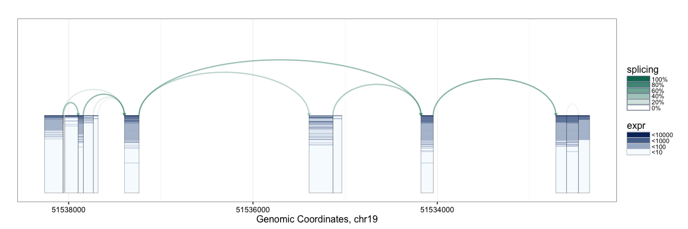
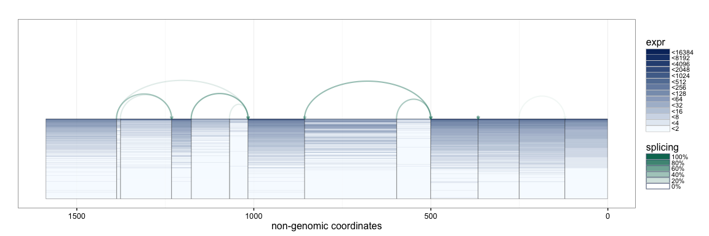
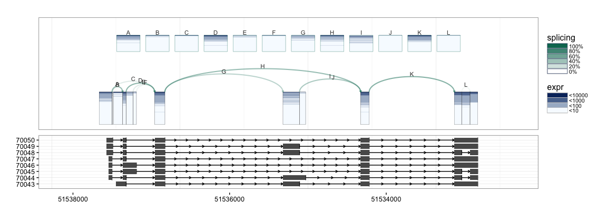
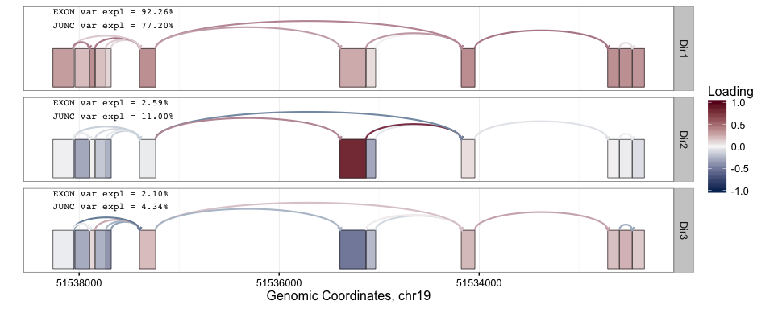
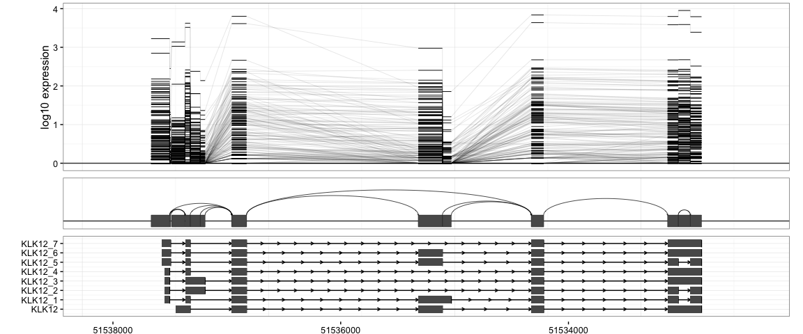
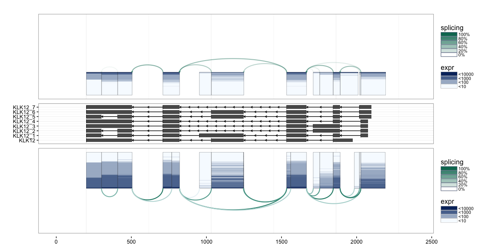
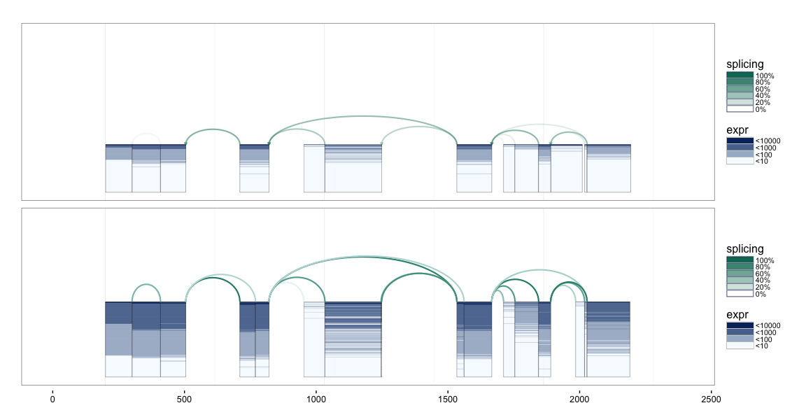

spliceclust  
==================================================================================================================================================================================================================================================================

Contents
--------

1.  [Introduction](#intro)
2.  [SpliceGraHM Examples](#splicegrahm)
3.  [SplicePCA Examples](#splicepca)
4.  [SplicePCP Examples](#splicepcp)
5.  [SpliceGraHM2 Examples](#splicegrahm2)

 Introduction
---------------------------------

This package may be used to plot exon and splice junction coverage
across a large cohort of RNA-seq samples. The plotting approach is based
on the idea of transposing expression heatmaps on splicing diagrams. The
plots are generated using the `ggplot2` and `ggbio` packages.

    ## load annotations packages
    library("TxDb.Hsapiens.UCSC.hg19.knownGene")
    library("BSgenome.Hsapiens.UCSC.hg19")

    ## load current package
    devtools::load_all()

 SpliceGraHM Examples
-----------------------------------------------

First we must construct a `concomp` object from a `GRangesList` object
with exon and junction boundaries and corresponding coverage values. For
illustration purposes, we use a previously constructed `GRanges` object,
`klk12_lusc_gr`, containing annotation information for the KLK12 gene
locus along with coverage for 177 lung squamous cell carcinoma samples.

    data("klk12_lusc_gr")

The exon and junction boundaries, and the corresponding kind label are
given by:

    ranges(klk12_lusc_gr)

    ## IRanges object with 25 ranges and 0 metadata columns:
    ##             start       end     width
    ##         <integer> <integer> <integer>
    ##   33127  51532348  51532468       121
    ##   33128  51532468  51532598       131
    ##   33129  51532469  51532597       129
    ##   33130  51532598  51532713       116
    ##   33131  51532713  51534044      1332
    ##     ...       ...       ...       ...
    ##   33147  51537896  51538051       156
    ##   33148  51537896  51538062       167
    ##   33149  51537897  51538040       144
    ##   33150  51538051  51538061        11
    ##   33151  51538062  51538261       200

    mcols(klk12_lusc_gr)$kind

    ##  [1] "e" "j" "e" "e" "j" "e" "j" "j" "j" "e" "e" "j" "e" "j" "j" "j" "j"
    ## [18] "e" "e" "e" "j" "j" "e" "e" "e"

In addition to `kind`, the `klk12_lusc_gr` metadata columns also include
the gene name (`gIdx`), gene boundaries (`gStart`, `gStop`), and
coverage values for the 177 samples.

    mcols(klk12_lusc_gr)[1:5, 1:6]

    ## DataFrame with 5 rows and 6 columns
    ##          gIdx    gStart     gStop        kind        s1        s2
    ##   <character> <numeric> <numeric> <character> <numeric> <numeric>
    ## 1    gene9317  51532348  51538261           e   2.60331   5.32231
    ## 2    gene9317  51532348  51538261           j   0.00000   0.00000
    ## 3    gene9317  51532348  51538261           e   2.59690  10.37210
    ## 4    gene9317  51532348  51538261           e   2.15517   7.28448
    ## 5    gene9317  51532348  51538261           j   0.00000   7.00000

To construct the `concomp` (connected component) object for analysis, we
first convert the `GRanges` object into a `GRangesList` object of length
2, corresponding to exon and junction information.

    klk12_gl <- split(klk12_lusc_gr, mcols(klk12_lusc_gr)$kind)
    klk12_cc <- concomp(klk12_gl)

We first demonstrate the default and **basic SpliceGraHM** (Splice Graph
Heat Map) plotting procedure.

    splicegrahm(klk12_cc)

In the plot above, each box arranged horizontally corresponds to a
contiguous exonic region along the genome. Each box is colored by 177
horizontal lines, showing the expression level for the 177 samples being
analyzed. Note that the exons are plotted along genomic coordinates, and
log expression is shown in color.

In addition to the boxes, the plot contains arrows which correspond to a
splicing events with sufficient support in the data (e.g. at least 8
samples, each with at least 5 reads spanning the splice junction). The
arrows are colored such that darker arrows were present in a higher
proportion of the 177 samples (scale shown on right).

The SpliceGraHM name is in reference to the fact that after removing the
spacing between each exon the plot simply reduces to a **standard
heatmap** of expression along a single gene. The corresponding figure
after removing the intronic gaps is shown below. The rectangle of color
is a heatmap with rows and columns corresponding to samples and exons,
respectively.

    splicegrahm(klk12_cc, genomic = FALSE, ex_use = 1, log_base = 2)

It is possible to show the coverage of each splice junction using a
similar convention with rows corresponding to samples, and with color
being used for coverage.

    splicegrahm(klk12_cc, genomic = FALSE, j_incl = TRUE)

If annotation information is available, e.g. from UCSC KnownGenes, these
can be passed to the function to add an additional track to the plot.
The appropriate `GRangesList` object to be passed is illustrated in the
following example.

    txdb <- TxDb.Hsapiens.UCSC.hg19.knownGene
    isActiveSeq(txdb)[seqlevels(txdb)] <- FALSE
    isActiveSeq(txdb)[paste0("chr", 1:22)] <- TRUE
    exbytx <- exonsBy(txdb, "tx")

    splicegrahm(klk12_cc, genomic = TRUE, j_incl = TRUE, txlist = exbytx)

If gene names are desired, the following can be used to match the
transcript ID in `txdb` against gene symbols (e.g. in `org.Hs.eg.db`).

    suppressPackageStartupMessages(library("org.Hs.eg.db"))

    splicegrahm(klk12_cc, genomic = TRUE, j_incl = TRUE, txlist = exbytx,
                txdb = txdb, orgdb = org.Hs.eg.db)

    ## 'select()' returned 1:1 mapping between keys and columns

    ## 'select()' returned many:1 mapping between keys and columns

The `splicegrahm` function can now also plot gene models in non-genomic
space with an additional parameter `eps`. The `eps` parameter determines
how far up/down from the connected component to lookfor overlapping gene
models. If `eps = NULL`, all overlapping gene models are included. If
`eps = 1000`, only overlapping gene models which are fully contained
within 1000bp of the connected component are included.

    splicegrahm(klk12_cc, genomic = FALSE, j_incl = TRUE, txlist = exbytx,
                txdb = txdb, orgdb = org.Hs.eg.db, eps = NULL)

    ## 'select()' returned 1:1 mapping between keys and columns

    ## 'select()' returned many:1 mapping between keys and columns

    splicegrahm(klk12_cc, genomic = FALSE, j_incl = TRUE, txlist = exbytx,
                txdb = txdb, orgdb = org.Hs.eg.db, eps = 1)

    ## 'select()' returned 1:1 mapping between keys and columns

    ## 'select()' returned many:1 mapping between keys and columns

    splicegrahm(klk12_cc, genomic = FALSE, j_incl = TRUE, txlist = exbytx,
                txdb = txdb, orgdb = org.Hs.eg.db, eps = 1000)

    ## 'select()' returned 1:1 mapping between keys and columns

    ## 'select()' returned many:1 mapping between keys and columns

 SplicePCA Examples
-------------------------------------------

Principal Component Analysis (PCA) is a popular exploratory analysis
tool for studying low rank structure in high-dimensional datasets by
projecting the data along the directions of greatest variation. These
directions of greatest variation are often referred to as the PC
"loading" directions. The `splicepca` function is written to visualize
the loading vectors of splicing data.

As an example, the following code can be used to visualize the first 3
PC loadings in the KLK12 dataset from above.

    splicepca(klk12_cc, npc = 3)

In the above PC loadings plot, red and blue are used to denote the
magnitude of the PC loadings for each exon and splice junction. From the
plot above, we see that the greatest source of variation in expression
at the KLK12 gene locus is the overall expression of the gene. However,
the second PC loading shows interesting behavior where the primary
source of variation is attributable to the expression of the central
exon. Scrolling up a little to the UCSC KnownGenes shown included above,
we see that the presence or absence of the central exon actually
corresponds to differing isoforms annotated to this gene. Note that
above the PCs are computed separately for exons and junctions
information. As such, we obtain separate PC "scores" for the exon and
junction PC loadings.

    splicepca(klk12_cc, npc = 3, scores = TRUE)

It is also possible to perform the PCA analysis using the concatenated
exon and junction information by setting the `pc_sep` parameter to
`FALSE`, and specifying the relative "weight" of each with `ej_w`. The
exon and junction data are rescaled to each have sum-of-squares equal to
the values specified by `ej_w`. In the following example, we use equal
weights for the two data sources.

    splicepca(klk12_cc, npc = 3, pc_sep = FALSE, ej_w = c(1, 1))

    splicepca(klk12_cc, npc = 3, pc_sep = FALSE, ej_w = c(1, 1), scores = TRUE)

 SplicePCP Examples
-------------------------------------------

All above plots have used color to represent expression. However, low
frequency or outlier events may become lost in this particular view. To
handle this problem, we also provide the option to plot the splicing
objects with vertical height (the y-axis) corresponding to expression.
The name of the function is a reference to [*parallel coordinates
plots*](pcp). The same *KLK12* data is shown below using the `splicepcp`
function.

    splicepcp(klk12_cc, genomic = TRUE, txlist = exbytx, txdb = txdb, orgdb = org.Hs.eg.db)

    ## 'select()' returned 1:1 mapping between keys and columns

    ## 'select()' returned many:1 mapping between keys and columns

The plot includes 3 tracks: 1. log-expression values for each exon or
region of an exon 2. the complete gene model and splice junctions 3.
annotated transcripts from the UCSC KnownGene database.

Currently, the function is being rewritten to also include junction
coverage using a parallel coordinates plot in a separate track.

 SpliceGraHM2 Examples
-------------------------------------------------

To make direct comparison of two populations possible, we have created
`splicegrahm2` which draws two `splicegrahm` plots in a single figure.
Consider, for example, the task of comparing the behavior of splicing
between the LUSC samples and head and neck squamous cell carcinoma
(HNSC) samples. We have loaded a connected component for 279 HNSC
samples as `klk12_hnsc_cc`.

    data("klk12_hnsc_cc")

    splicegrahm2(klk12_cc, klk12_hnsc_cc, genomic=FALSE)

When gene models are also desired, they are placed in a central track
for easy comparison to the two `splicegrahm`s.

    splicegrahm2(klk12_cc, klk12_hnsc_cc, genomic=FALSE,
                 txlist = exbytx, txdb = txdb, orgdb = org.Hs.eg.db)

    ## 'select()' returned 1:1 mapping between keys and columns

    ## 'select()' returned many:1 mapping between keys and columns

Alternatively, the bottom plot can be drawn with the same orientation as
the top plot by setting `mirror=FALSE`.

    splicegrahm2(klk12_cc, klk12_hnsc_cc, genomic=FALSE, mirror=FALSE)

This plotting scheme may be useful for comparing two subpopulations from
a single dataset. Suppose we perform clustering on the LUSC dataset
using the `cluster` function implemented in the `spliceclust` package.
Note that the two clusters differ in their usage of the central exon,
with a clear difference in expression and splicing at this exon.

    lbls <- cluster(klk12_cc)

    ##create connected component with just cluster 2 samples
    klk12_cc2 <- klk12_cc
    exonValues(klk12_cc2) <- exonValues(klk12_cc)[, lbls$junc_labs == 2]
    juncValues(klk12_cc2) <- juncValues(klk12_cc)[, lbls$junc_labs == 2]

    ##create connected component with just cluster 3 samples
    klk12_cc3 <- klk12_cc
    exonValues(klk12_cc3) <- exonValues(klk12_cc)[, lbls$junc_labs == 3]
    juncValues(klk12_cc3) <- juncValues(klk12_cc)[, lbls$junc_labs == 3]

    splicegrahm2(klk12_cc2, klk12_cc3, genomic=FALSE, sort_idx1=6, sort_idx2=6)

While not modified above, the option `same_scale` can be used to specify
whether the two plots should be drawn using the same or separate scale
along the y-axis. This can be helpful when the two populations are of
substantially different sizes.

 Session Information
----------------------------------------------

    sessionInfo()

    ## R version 3.3.1 (2016-06-21)
    ## Platform: x86_64-apple-darwin15.5.0 (64-bit)
    ## Running under: OS X 10.11.5 (El Capitan)
    ## 
    ## locale:
    ## [1] en_US.UTF-8/en_US.UTF-8/en_US.UTF-8/C/en_US.UTF-8/en_US.UTF-8
    ## 
    ## attached base packages:
    ## [1] stats4    parallel  stats     graphics  grDevices utils     datasets 
    ## [8] methods   base     
    ## 
    ## other attached packages:
    ##  [1] spliceclust_0.1.3                      
    ##  [2] org.Hs.eg.db_3.3.0                     
    ##  [3] BSgenome.Hsapiens.UCSC.hg19_1.4.0      
    ##  [4] BSgenome_1.40.1                        
    ##  [5] rtracklayer_1.32.1                     
    ##  [6] Biostrings_2.40.2                      
    ##  [7] XVector_0.12.0                         
    ##  [8] TxDb.Hsapiens.UCSC.hg19.knownGene_3.2.2
    ##  [9] GenomicFeatures_1.24.3                 
    ## [10] AnnotationDbi_1.34.3                   
    ## [11] Biobase_2.32.0                         
    ## [12] GenomicRanges_1.24.2                   
    ## [13] GenomeInfoDb_1.8.1                     
    ## [14] IRanges_2.6.1                          
    ## [15] S4Vectors_0.10.1                       
    ## [16] BiocGenerics_0.18.0                    
    ## 
    ## loaded via a namespace (and not attached):
    ##  [1] httr_1.2.0                    AnnotationHub_2.4.2          
    ##  [3] splines_3.3.1                 Formula_1.2-1                
    ##  [5] shiny_0.13.2                  interactiveDisplayBase_1.10.3
    ##  [7] latticeExtra_0.6-28           RBGL_1.48.1                  
    ##  [9] Rsamtools_1.24.0              RSQLite_1.0.0                
    ## [11] lattice_0.20-33               biovizBase_1.20.0            
    ## [13] chron_2.3-47                  digest_0.6.9                 
    ## [15] RColorBrewer_1.1-2            colorspace_1.2-6             
    ## [17] ggbio_1.20.2                  htmltools_0.3.5              
    ## [19] httpuv_1.3.3                  Matrix_1.2-6                 
    ## [21] plyr_1.8.4                    OrganismDbi_1.14.1           
    ## [23] XML_3.98-1.4                  devtools_1.12.0              
    ## [25] biomaRt_2.28.0                zlibbioc_1.18.0              
    ## [27] xtable_1.8-2                  scales_0.4.0                 
    ## [29] BiocParallel_1.6.2            ggplot2_2.1.0                
    ## [31] withr_1.0.2                   SummarizedExperiment_1.2.3   
    ## [33] nnet_7.3-12                   crayon_1.3.2                 
    ## [35] survival_2.39-5               magrittr_1.5                 
    ## [37] mime_0.4                      memoise_1.0.0                
    ## [39] evaluate_0.9                  GGally_1.2.0                 
    ## [41] foreign_0.8-66                graph_1.50.0                 
    ## [43] BiocInstaller_1.22.3          tools_3.3.1                  
    ## [45] data.table_1.9.6              formatR_1.4                  
    ## [47] stringr_1.0.0                 munsell_0.4.3                
    ## [49] cluster_2.0.4                 ensembldb_1.4.7              
    ## [51] compiler_3.3.1                grid_3.3.1                   
    ## [53] RCurl_1.95-4.8                dichromat_2.0-0              
    ## [55] VariantAnnotation_1.18.1      labeling_0.3                 
    ## [57] bitops_1.0-6                  rmarkdown_0.9.6              
    ## [59] testthat_1.0.2                gtable_0.2.0                 
    ## [61] DBI_0.4-1                     reshape_0.8.5                
    ## [63] roxygen2_5.0.1                reshape2_1.4.1               
    ## [65] R6_2.1.2                      GenomicAlignments_1.8.3      
    ## [67] gridExtra_2.2.1               knitr_1.13                   
    ## [69] Hmisc_3.17-4                  stringi_1.1.1                
    ## [71] Rcpp_0.12.5                   rpart_4.1-10                 
    ## [73] acepack_1.3-3.3
